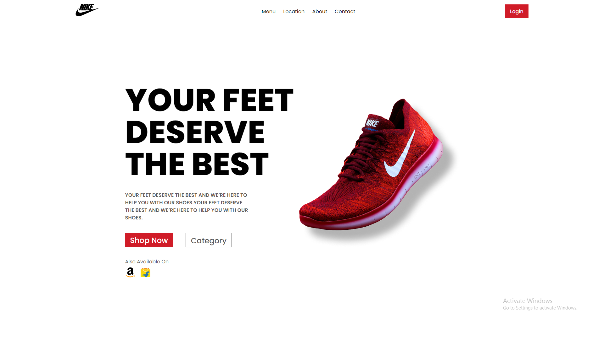

🚀 **React Projects Repository**

Welcome to our GitHub repository for React projects! 🌐

This is the hub for all the exciting front-end development work we're doing using React, a powerful JavaScript library for building user interfaces. Whether you're a developer looking to contribute, a collaborator interested in our codebase, or someone exploring React for the first time, you're in the right place!

**Key Features:**
- ✨ **React Magic:** Our projects leverage the flexibility and efficiency of React to create dynamic and interactive user interfaces.
- 📦 **Modular Components:** Dive into our well-organized component architecture for reusable and maintainable code.
- 🛠 **State-of-the-Art Development:** We keep up with the latest React trends and best practices to ensure efficient and modern development workflows.
- 🌐 **Responsive Design:** Our projects prioritize responsiveness, delivering a seamless experience across various devices and screen sizes.

**Getting Started:**
1. 📋 Check out the project's documentation for installation and setup instructions.
2. 🛠 Explore the source code to understand the structure and functionality.
3. 💡 Contribute by opening issues, submitting pull requests, or suggesting improvements.

**Projects Included:**
- 🌈 [Project 1 Brand Page]: []

**Community and Support:**
- 🤝 Join our community discussions and share your insights.
- ❓ Have questions? Open an issue, and our team will be happy to assist.

**Contributing:**
- 🌟 We welcome contributions! Check out our contributing guidelines to get started.

Thanks for visiting our React Projects Repository! We look forward to collaborating and building awesome things together. 🚀✨

Happy Coding! 👩‍💻👨‍💻

---